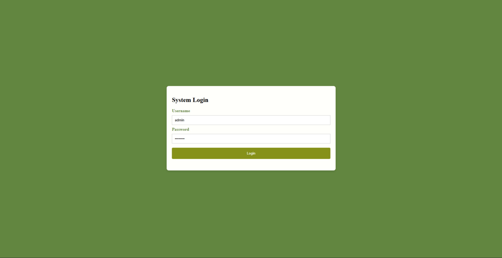
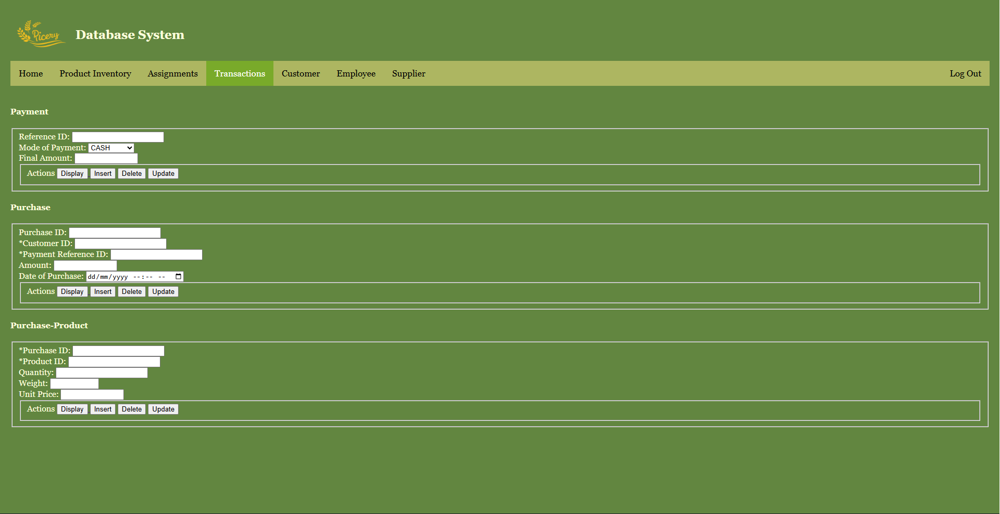

# Ricery — Rice Business Management System

**Course:** Information Management | University of Santo Tomas  
**Term:** 1st Term, AY 2025-2026 | Section 2DSA2

**Group 4:**
Geronimo, Atasha Samantha T. • Gianan, Zarinah Lindsay C.  
Oyales, Cherelle Valkyrie R. • Villanueva, Alecsandra Z.

---

## Overview
Ricery is a web-based database management system simulating 
the operations of a rice retail business. It supports two 
user roles — Admin and Employee — each with different access 
levels and functionalities across product inventory, 
transactions, customer records, and supplier management.

---

## Features

### Admin View
- Full access to all modules
- Product Inventory — add, update, delete, display rice products
- Assignments — manage product-employee task delegations
- Transactions — handle payments, purchases, purchase-products
- Customer — manage customer records
- Employee — manage employee records
- Supplier — manage supplier records

### Employee View
- Limited access to Product Inventory, Transactions, and Customer tabs
- Can display, insert, update, and delete within allowed modules

---

## Tech Stack
| Layer | Technology |
|---|---|
| Frontend | HTML, CSS |
| Backend | PHP |
| Database | MySQL |

## Database Tables
`PRODUCT` `EMPLOYEE` `PRODUCT_EMPLOYEE` `SUPPLIER`
`CUSTOMER` `PURCHASE` `PAYMENT` `PURCHASE_PRODUCT`

---

## How to Run

1. Install [XAMPP](https://www.apachefriends.org/) or any local server
2. Clone or download this repository into your `htdocs` folder
3. Open **phpMyAdmin** and import `project_database.sql`
4. Configure your database credentials in `backend/db.php`
5. Open your browser and go to `http://localhost/Ricery/frontend/login.html`
6. Log in using your assigned credentials

### Login Roles
| Role | Username |
|---|---|
| Admin | admin |
| Employee | employee |

---

## Screenshots

### Admin Login Page

### Admin Dashboard: Transaction Page

### User Dashboard: Transaction Page

---

## Documentation
Full system documentation including ER diagram, data dictionary,
and interface guide is available in `docs/final_docu_short.pdf`
